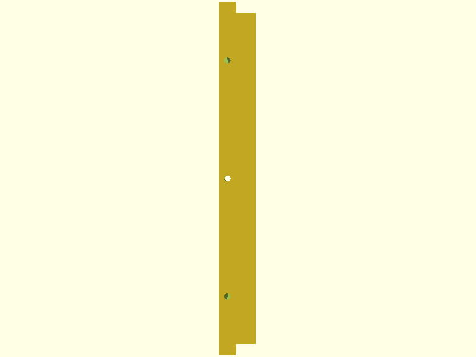

## Trofast Flexible Runner

This is a set of customizable OpenSCAD models for 3D-printing drawer runners designed to fit the IKEA Trofast system. It was built to solve a specific problem under my desk—metal beams that blocked off the first 40mm of space. This model works around that limitation by raising the rail mount points accordingly, with some flexibility built in.

### Use Case

The default config assumes there's a 40mm gap before mounting can begin, and uses M8 screws with a 50mm length, giving 15mm of screw depth into the surface. Everything's modeled with enough tolerance to fit real-world hardware, and the `Test` mode is there to save you material if you just want to check fitment before committing to a full print.

### Variants

- **Center** – Rails on both sides (goes in the middle).
- **Left** – Mounts to the left, rails on the right.
- **Right** – Mounts to the right, rails on the left.
- **Test** – Minimal section for print/fit testing.

Switch between them using the `mode` variable in `Trofast_Flexible_Runners.scad` or via the `Makefile`.

### Building

Just run:

```bash
make
```

This builds all four variants (`Center`, `Left`, `Right`, `Test`) and generates preview images (`front`, `side`, `top`) for each. Outputs land in the `output/` directory.

Need to clean things up?

```bash
make clean
```

You’ll need `openscad` in your PATH for this to work.

### Customization

All measurements are parametric and editable in the SCAD file:
- **Beam height/width**
- **Rail width/height**
- **Screw dimensions**
- **Clearances**

The default setup is battle-tested for my setup, but tweak away. That’s the point.

---

### Preview Grid

Below is a snapshot from my actual build outputs—each variant with its key angles.

#### Center Variant
| Front | Side | Top |
|:-----:|:----:|:---:|
|  |  |  |

#### Left Variant
| Front | Side | Top |
|:-----:|:----:|:---:|
|  |  |  |

#### Right Variant
| Front | Side | Top |
|:-----:|:----:|:---:|
|  |  |  |

#### Test Variant
| Front | Side | Top |
|:-----:|:----:|:---:|
|  |  |  |
